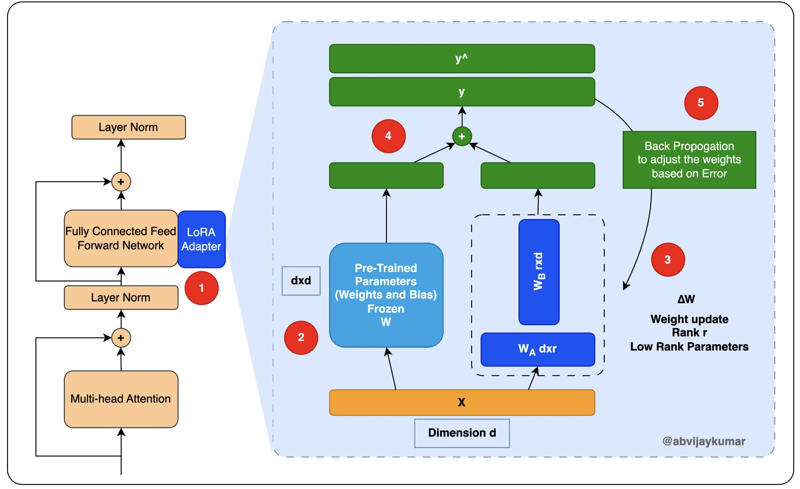

# Project: Fine-Tuning Microsoft/phi-1 LLM Base Model on alpaca-gpt4 Instruction Datasets 

Key steps:
- Utilized PEFT/LoRA techniques for fine-tuning the Microsoft/phi-1_5 pre-trained model on alpaca-gpt4 datasets.

- Leveraged advanced training approaches to refine the model's capabilities, aiming for improved precision, recall,
and other relevant metrics.

For the fine-tuned model and parameters, please check: [HuggingFace](https://huggingface.co/ehsangharibnezhad/phi-1_5-finetuned-vicgalle-alpaca-gpt4)

